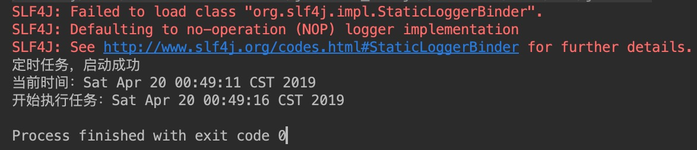

[](https://jitpack.io/#fengwenyi/JavaLib-quartz)

<h1 align="center">JavaLib-quartz</h1>

之前版本是基于Spring Boot Quartz，后来因为一些原因，被舍弃了，当前是基于企业级定时任务框架Quartz Job Scheduling开发的，目的是帮你快速构建定时任务系统，你可以专心编写你的业务逻辑，而不必关注定时任务具体是如何实现的

## 如何快速开始？

#### 第一步：添加依赖

```xml
    <repositories>
        <repository>
            <id>jitpack.io</id>
            <url>https://jitpack.io</url>
        </repository>
    </repositories>
    
    <dependencies>
        <dependency>
            <groupId>com.github.fengwenyi</groupId>
            <artifactId>JavaLib-quartz</artifactId>
            <version>1.0.2</version>
        </dependency>
    </dependencies>
```

#### 第二步：编写我们的任务逻辑

```java
public class HelloJob implements Job {
    public void execute(JobExecutionContext jobExecutionContext) throws JobExecutionException {
        System.out.println("开始执行任务：" + new Date());
    }
}
```
    
#### 第三步：编写测试代码

```java
@Test
public void test() {
    try {
        QuartzTask quartzTask = new QuartzTask();
        Scheduler scheduler = StdSchedulerFactory.getDefaultScheduler();
        String jobName = "JOB";
        String triggerName = "TRIGGER";
        ScheduleBean scheduleBean = new ScheduleBean(scheduler, HelloJob.class, jobName, triggerName);
        scheduleBean.setTimeType(TimeTypeEnum.AT_TIME);
        scheduleBean.setAtTime(System.currentTimeMillis() + 1000 * 5); // 5s之后运行
        boolean rs = quartzTask.start(scheduleBean);
        if (rs)
            System.out.println("定时任务，启动成功");
        else
            System.out.println("定时任务，启动失败");
        System.out.println("当前时间：" + new Date());
        //运行一段时间后关闭
        Thread.sleep(10000);
    } catch (SchedulerException | InterruptedException e) {
        e.printStackTrace();
    }
}
```

第6步、运行效果



### API

| 名称             | 方法    | 参数           | 返回类型 | 说明|
|---               |---     |---            |---      |---|
| 开启定时任务       | start  | (ScheduleBean) |boolean | 开启是否成功，true:成功，false:失败|
| 定时任务当前状态    | status | -              |boolean | 定时任务当前状态，true:运行中，false:已停止|
| 停止定时任务       | stop   |  -             |boolean | 定时任务停止是否成功，true:成功，false:失败|

### ScheduleBean字段说明

|名称|参数|类型|说明|
|---|---|---|---|
|Scheduler|scheduler|Scheduler|Scheduler 对象|
|编号|id|Long| -，保留字段|
|名称|name|String|-，保留字段|
|描述|description|String|-，保留字段|
|选用类型|timeTime|TimeTypeEnum|选用构造Trigger对象类型|
|job类|clazz|Class<? extends Job>|定时任务执行的job类|
|job参数|paramJobMap|Map<String, Object>|定时任务执行的job类|
|job类|paramTriggerMap|Map<String, Object>|定时任务执行的job类|
|cron表达式|cron|String|cron表达式|
|时间间隔|time|Integer|每隔一段时间执行一次|
|时间间隔|atTime|Long|指定一个时间点执行（毫秒数）|
|Job名称|jobName|String|Job名称|
|Job组|jobGroup|String|Job组名称|
|TriggerName|triggerName|String|Trigger名称|
|Trigger组|triggerGroup|String|Trigger组名称|

### TimeTypeEnum

字段说明

|字段|类型|说明|
|---|---|---|
|code|Integer|代码|
|msg|String|说明|

值说明

|名称|代码|说明|
|---|---|---|
|SIMPLE|1|简单的定时任务，每隔一段时间执行一次|
|AT_TIME|2|指定一个时间点执行（毫秒数[Long]）|
|CRON|3|使用cron表达式（时间点、循环、自定义时间）|

### wiki

一、需要在Job中注入Service

使用 `@Autowired` 注解

    @Autowired
    private DBService dbService;


二、每隔一段时间执行一次

```java
    int time;
    ScheduleBean scheduleBean;
    scheduleBean.setTimeType(TimeTypeEnum.SIMPLE);
    scheduleBean.setTime(time);
```

三、指定一个时间点执行一次

```java
    long atTime;
    ScheduleBean scheduleBean;
    scheduleBean.setTimeType(TimeTypeEnum.AT_TIME);
    scheduleBean.setAtTime(atTime);
```

四、通过使用cron表达式执行

```java
    String cron;
    ScheduleBean scheduleBean;
    scheduleBean.setTimeType(TimeTypeEnum.CRON);
    scheduleBean.setCron(cron);
```

五、参数

```java
    // 将参数放到job中
    Map<String, Object> jobMap;
    ScheduleBean scheduleBean;
    scheduleBean.setParamJobMap(jobMap);

    // 将参数放到trigger中
    Map<String, Object> triggerMap;
    ScheduleBean scheduleBean;
    scheduleBean.setParamTriggerMap(triggerMap);
```

六、关于在job获取参数

两种思路：
一是通过map的key获取值，
二是通过构造与map的key相同的属性，提供set方法

```java
    // 获取自己的参数
    JobDataMap jobDataMap = context.getJobDetail().getJobDataMap();
    jobDataMap.getInt("");
    jobDataMap.getString("");
    jobDataMap.getFloat("");
    jobDataMap.getDouble("");
    JobDataMap triggerDataMap =  context.getTrigger().getJobDataMap();

    // 合并
    // 如果job和trigger的key相同，trigger会覆盖job的值
    JobDataMap dataMap = context.getMergedJobDataMap();
```


七、在job中获取jobDetail、trigger基础信息

```java
    // 获取jobDetail相关
    JobKey jobKey = context.getJobDetail().getKey();
    jobKey.getName();
    jobKey.getGroup();
    jobKey.getClass().getName();
    // 获取trigger相关
    TriggerKey triggerKey = context.getTrigger().getKey();
    triggerKey.getName();
    triggerKey.getGroup();
```

八、task目前支持的方法

开启任务：start

查看当前任务状态：status

停止任务：stop

### 策略

1、优先选用指定方式构造Trigger

2、检查顺序：cron->atTime->simple，执行顺序：simple > atTime > cron 自下而上进行覆盖

### Licensed

```
   Copyright 2018-2019 Erwin Feng(xfsy_2015@163.com)

   Licensed under the Apache License, Version 2.0 (the "License");
   you may not use this file except in compliance with the License.
   You may obtain a copy of the License at

       http://www.apache.org/licenses/LICENSE-2.0

   Unless required by applicable law or agreed to in writing, software
   distributed under the License is distributed on an "AS IS" BASIS,
   WITHOUT WARRANTIES OR CONDITIONS OF ANY KIND, either express or implied.
   See the License for the specific language governing permissions and
   limitations under the License.